<picture>
  <source media="(prefers-color-scheme: dark)" srcset="assets/header-dark.svg">
  <source media="(prefers-color-scheme: light)" srcset="assets/header-light.svg">
  
</picture>

 

 

I build the systems around AI models: the context they receive, the tools they can use, the checks their outputs must pass, and the feedback that improves the next run.

At **Printerpix** I own a research-to-publishing agent system spanning **nine markets and five product lines**, from stakeholder requirements to evaluated, approval-gated releases. My background covers document retrieval, event-driven backends, and ML connected to physical sensors. I like problems where understanding a failure means following it across the model, the code, and the underlying data.

 

<picture>
  <source media="(prefers-color-scheme: dark)" srcset="assets/pipeline-dark.svg">
  <source media="(prefers-color-scheme: light)" srcset="assets/pipeline-light.svg">
  
</picture>

  
  
  
  
  

## Selected engineering work

### Agent orchestration and release controls
Built on Claude Code with custom subagents and hooks, the system separates generation, review, and tooling agents. Structured outputs and stateful handoffs carry work between stages, and a human approves every external action.

- **15 pre-release checks** covering citations, product fidelity, legibility, deduplication, and composition.
- Each send is bound to the exact asset, account, and platform, with approval expiry, dry-run/live separation, duplicate prevention, and supervised sends isolated from unattended schedules.
- Recurring failures become reusable acceptance criteria and production recipes.

### Evaluation that checks the evaluator
- Split review into independent **product-accuracy, artwork-fidelity, and creative-quality** passes.
- Audited the automated checks themselves: a pixel-level review of **130 renders** exposed blind spots in the rejection logic and recovered a strong candidate at zero generation cost.
- Joined **127 published assets** to platform outcomes, traced repetitive output to legacy briefs and stale assets, and added classification and batch-diversity checks. Along the way, caught a platform reporting anomaly before it could skew creative decisions.

### Market intelligence that changes generation
Weekly competitor sweeps and scheduled trend checks turn observations into **source-linked findings and reusable generation constraints**. Publication records join back to performance data, closing the loop from research to generation to review. The findings drove a redesign of the cover creative system.

### Model selection by evidence
- Set up the office's **self-hosted Qwen infrastructure** and own its authenticated API integration and task routing, weighing capability, cost, and latency per task.
- Tested **Jev via Vercel AI Gateway** against human-labelled examples, disjoint dev/holdout sets, and rule-based baselines. The results scoped it to occasion detection and relevance triage; deterministic code beat it on caption mechanics and stayed in place.
- Extending the same evaluation to Arabic-first open models (**Jais 2, ALLaM**) on Gulf-dialect tasks.

### Data applications and diagnostic agents
- **Audit automation:** a FastAPI/Next.js agent that inspects tags, triggers, event schemas, and consent states across **nine Google Tag Manager properties**, producing evidence-linked findings for human review.
- **Financial data:** co-built a BigQuery contribution-margin platform joining analytics, advertising, email, and product data, with source-parity checks and **476+ automated platform tests**.

<strong>Earlier work: retrieval, backend systems, and hardware</strong>

 

- **Dasseti:** document Q&A prototypes on C#/.NET 8, Semantic Kernel, and PostgreSQL, covering chunking, retrieval, and plugin interfaces; evaluated MCP and agent architectures.
- **Karbon-Art:** Python/scikit-learn predictive-maintenance prototypes; restored USB-serial telemetry ingestion, working across software and physical sensors.
- **NextGen Trader:** Kafka and PostgreSQL backend and reporting components for event-driven trading workflows.

## Toolkit

  <picture>
    <source media="(prefers-color-scheme: dark)" srcset="https://skillicons.dev/icons?i=py,ts,js,cs,fastapi,nextjs,react,nodejs,dotnet,gcp,postgres,kafka,docker,vercel&theme=dark&perline=14">
    <source media="(prefers-color-scheme: light)" srcset="https://skillicons.dev/icons?i=py,ts,js,cs,fastapi,nextjs,react,nodejs,dotnet,gcp,postgres,kafka,docker,vercel&theme=light&perline=14">
    
  </picture>

| Area | Tools and practices |
| :--- | :--- |
| **Agent systems** | Claude Code harness (subagents, hooks), multi-agent orchestration, generator/reviewer separation, tool calling, structured outputs, stateful handoffs, human-in-the-loop approval, MCP, RAG |
| **Evaluation** | Evaluator audits, rubric-separated review, human-labelled datasets, dev/holdout splits, rule-based baselines, outcome-data joins, failure analysis, regression tests |
| **Models** | Self-hosted Qwen, Vercel AI Gateway, task-level routing, cost/latency trade-offs, Semantic Kernel |
| **Languages** | Python, TypeScript/JavaScript, SQL, C# |
| **Backend and data** | FastAPI, Next.js/React, Node.js, .NET 8, BigQuery, PostgreSQL, Kafka, Docker |
| **Development** | Claude Code as primary environment, alongside Codex; all generated code reviewed and tested before merge |

## How I work

<table>
<tr>
<td width="50%" valign="top">

**Trace the failure.** 
Inspect inputs, intermediate artifacts, tool behavior, and outputs before choosing a fix.

</td>
<td width="50%" valign="top">

**Separate evidence from judgment.** 
Keep source facts, model assessments, deterministic checks, and human decisions distinguishable.

</td>
</tr>
<tr>
<td width="50%" valign="top">

**Control side effects.** 
Generating a proposal and authorizing an external action are separate engineering responsibilities.

</td>
<td width="50%" valign="top">

**Make improvements testable.** 
Turn a failure into a reproducible case, compare against a baseline, and keep the check after the fix.

</td>
</tr>
</table>

## Experience

| Role | Company | Dates |
| :--- | :--- | :--- |
| **AI Engineer** | Printerpix | Apr 2026 – present |
| AI Application Developer Intern | Dasseti | Jul 2025 – Sep 2025 |
| ML and IoT Engineering Intern | Karbon-Art | Jan 2025 – Jun 2025 |
| Software Engineering Intern | NextGen Trader | Jun 2024 – Dec 2024 |

**BEng (Hons) Computer Systems Engineering, First Class Honours**, Middlesex University Dubai, 2025

 

<picture>
  <source media="(prefers-color-scheme: dark)" srcset="https://raw.githubusercontent.com/ahmedkhan-2004/ahmedkhan-2004/output/github-snake-dark.svg">
  <source media="(prefers-color-scheme: light)" srcset="https://raw.githubusercontent.com/ahmedkhan-2004/ahmedkhan-2004/output/github-snake.svg">
  
</picture>

  

Interested in applied AI and agent-engineering roles with ownership across implementation, evaluation, and deployment.

**[Email me](mailto:ahmed2004.akn@gmail.com)** · **[Connect on LinkedIn](https://www.linkedin.com/in/ahmedkhan04/)** · **[Browse repositories](https://github.com/ahmedkhan-2004?tab=repositories)**

