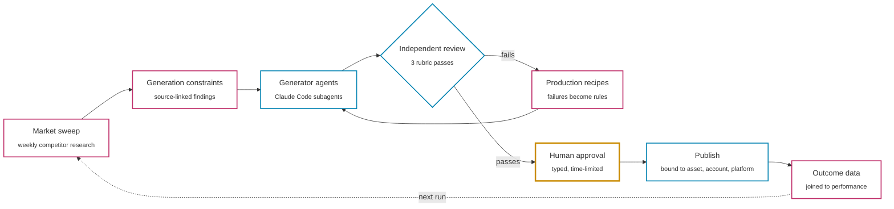

# Ahmed Khan

**Applied AI Engineer in Dubai.** I build the unglamorous half of AI systems: the evals, the gates, and the off switch. It turns out that's the half that decides whether anything ships.

[LinkedIn](https://www.linkedin.com/in/ahmedkhan04/) · [Email](mailto:ahmed2004.akn@gmail.com) · [Repositories](https://github.com/ahmedkhan-2004?tab=repositories)

| 9 markets | 5 product lines | 15 release checks | 130 renders audited | 127 assets joined to outcomes |
| :---: | :---: | :---: | :---: | :---: |
| covered by one agent system | with per-market readiness | before anything publishes | to test the evaluator itself | to find why output repeated |

## The system I own

At **Printerpix**, I built and own the agent harness behind our marketing creative. It runs on **Claude Code with custom subagents and hooks**, and every stage exists to make the next run better than the last.

Pink: evidence stages. Blue: model and execution stages. Amber: the human gate. Nothing reaches an external platform without passing it.

## Selected engineering work

### Evaluation that checks the evaluator

Review runs as independent **product-accuracy, artwork-fidelity, and creative-quality** passes. Then I audited the automated checks themselves: a pixel-level review of **130 renders** exposed blind spots in the rejection logic and recovered a strong candidate without another generation call.

The failure I'm fondest of wasn't in the code. Joining **127 published assets** to platform outcomes showed output had narrowed to one dominant composition, so a quality score calibrated on that data couldn't be trusted. I withheld the score, traced the cause upstream to legacy briefs and stale assets, and added classification and batch-diversity checks.

### Release controls

- **15 pre-release checks** that separate deterministic constraints from model judgments: claim grounding, product fidelity, legibility, deduplication, composition.
- Every send is **bound to the exact asset, account, and platform**, with approval expiry, dry-run/live separation, duplicate prevention, and reason-coded refusals.
- Supervised publishing is isolated from unattended schedules.

### Market intelligence that changes generation

Weekly competitor sweeps and scheduled trend checks turn observations into **source-linked findings and generation constraints**. Publication records join back to performance data, so research is tested against outcomes, not just collected. The findings drove a redesign of the cover creative system.

### Model selection by evidence

I set up the office's **self-hosted Qwen infrastructure** and own its authenticated integration and task-level routing by capability, cost, and latency.

I tested **Jev through Vercel AI Gateway** against human-labelled examples, disjoint development and holdout sets, and rule-based baselines. It earned a focused role in occasion detection and relevance triage. Deterministic code beat it on caption mechanics, so the code stayed. Next, I'm extending the same evaluation to Arabic-first open models (Jais 2, ALLaM) on Gulf-dialect tasks.

### Diagnostic agents and data systems

- **Audit agent:** FastAPI/Next.js agent that inspects tags, triggers, event schemas, and consent states across **nine Google Tag Manager properties**, producing evidence-linked findings for human review.
- **Financial data:** co-built a BigQuery contribution-margin platform over analytics, advertising, email, and product data, with source-parity checks and **476+ automated tests**.

<strong>Earlier work: retrieval, trading backends, and hardware</strong>

 

- **Dasseti:** document Q&A prototypes in C#/.NET 8 with Semantic Kernel and PostgreSQL, covering chunking, retrieval, and plugin interfaces; evaluated MCP and agent architectures.
- **Karbon-Art:** Python/scikit-learn predictive-maintenance prototypes, and restored USB-serial telemetry ingestion from physical sensors.
- **nTrader:** Kafka and PostgreSQL backend and reporting components for event-driven trading workflows.

## Toolkit

| Area | What I use and how |
| :--- | :--- |
| Agent systems | Claude Code harness (subagents, hooks), multi-agent orchestration, generator/reviewer separation, tool calling, structured outputs, stateful handoffs, human-in-the-loop approval, MCP, RAG |
| Evaluation | Evaluator audits, rubric-separated review, human-labelled datasets, dev/holdout splits, rule-based baselines, outcome-data joins, failure analysis, regression tests |
| Models | Self-hosted Qwen, Vercel AI Gateway, task-level routing, cost and latency trade-offs |
| Languages | Python, TypeScript/JavaScript, SQL, C# |
| Backend and data | FastAPI, Next.js/React, Node.js, .NET 8, Semantic Kernel, BigQuery, PostgreSQL, Kafka, Docker |
| Development | Claude Code as my primary environment, with Codex and Cursor; every generated change is reviewed and tested before merge |

## How I work

**Trace the failure.** Inspect inputs, intermediate artifacts, tool behavior, and outputs before choosing a fix.

**Separate evidence from judgment.** Keep source facts, model assessments, deterministic checks, and human decisions distinguishable.

**Control side effects.** Generating a proposal and authorizing an external action are separate engineering responsibilities.

**Make improvements testable.** Turn a failure into a reproducible case, compare it against a baseline, and keep the check after the fix.

---

**BEng (Hons) Computer Systems Engineering, First Class Honours**, Middlesex University Dubai, 2025

If you're building agents that have to work on a Tuesday afternoon and not just in the launch video, I'd enjoy talking. [Email me](mailto:ahmed2004.akn@gmail.com) or [connect on LinkedIn](https://www.linkedin.com/in/ahmedkhan04/).
